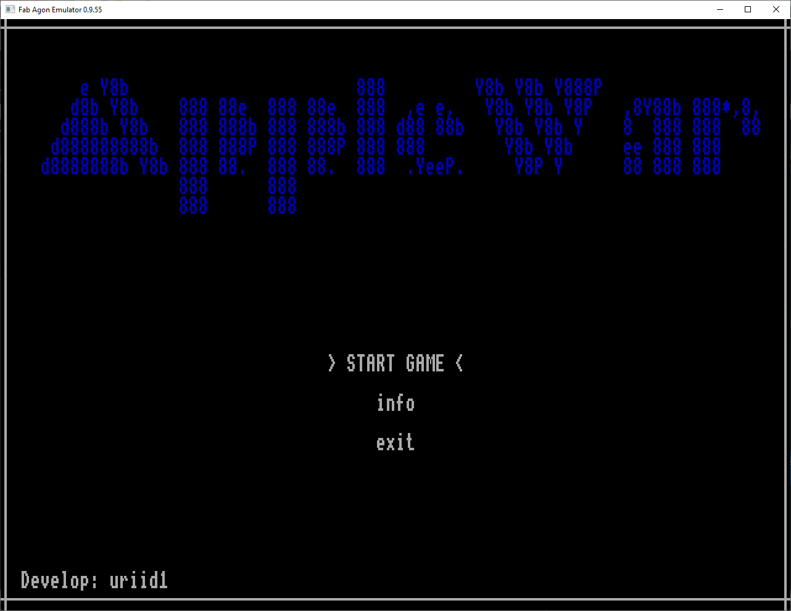

## Apple War

```css
     e Y8b                       888         Y8b Y8b Y888P 
    d8b Y8b    888 88e  888 88e  888  ,e e,   Y8b Y8b Y8P   ,8Y88b 888*,8,
   d888b Y8b   888 888b 888 888b 888 d88 88b   Y8b Y8b Y    8  888 888  88 
  d888888888b  888 888P 888 888P 888 888        Y8b Y8b     ee 888 888      
 d8888888b Y8b 888 88.  888 88.  888  .YeeP.     Y8P Y      88 888 888      
               888      888
               888      888   

```
# From the original author:
This is a small game written in C. <br />
Your task is to collect all the apples while avoiding enemies. <br />
I do not recommend using the source code for learning C.
I wrote this game just for fun :)
Have a good game!

## Movement:<br />
 Arrows - move <br />
 Space - shot <br />
 q - open menu <br />

## Screenshots



# Compiling
You must have acurses (included in the src directory) and AgDev C installed.

# Notes
The redraw isn't very quick so the flickering is quite heavy. The non-blocking keyboard routines do not behave well.

Original game can be found here: [https://github.com/uriid1/ascii-c-game/]

