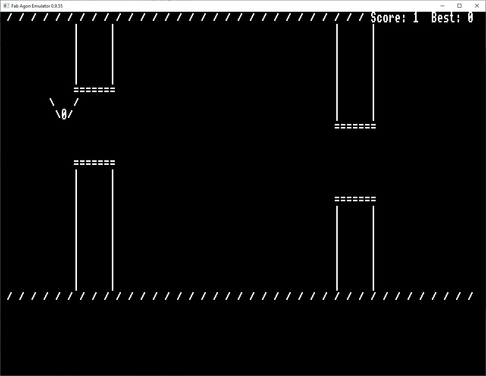
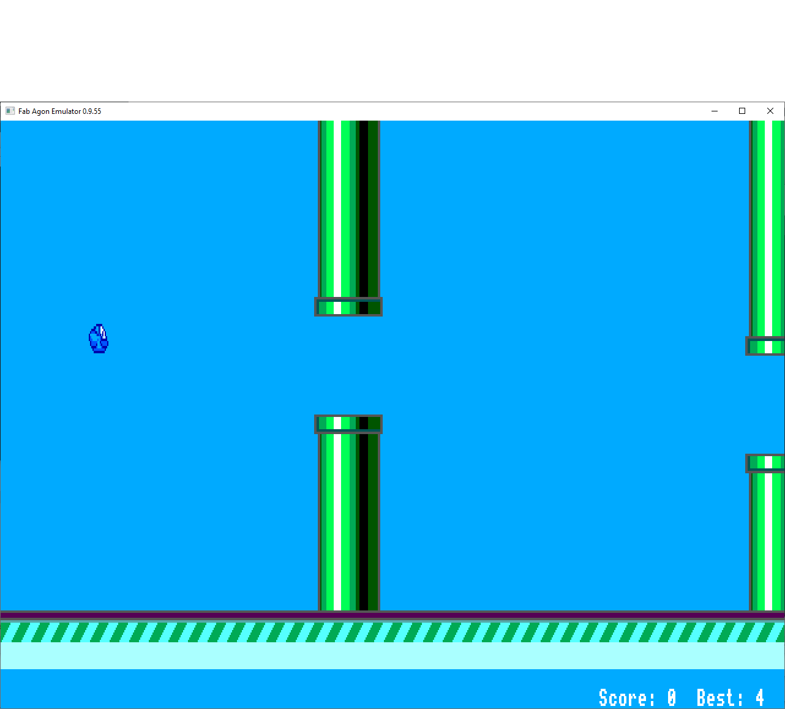

# Flappy Agon Bird - FlAgon!

This is the ASCII curses library Flappy Bird game which has been adapted to make the most of the console 8 graphics features allowing characters to be mapped to bitmaps.

The result is that under the hood, the game that makes this:

is the same game engine as the game that makes this:

# Compiling
Use AgDev C compiler and simply take `make` from the directory with the makefile.
